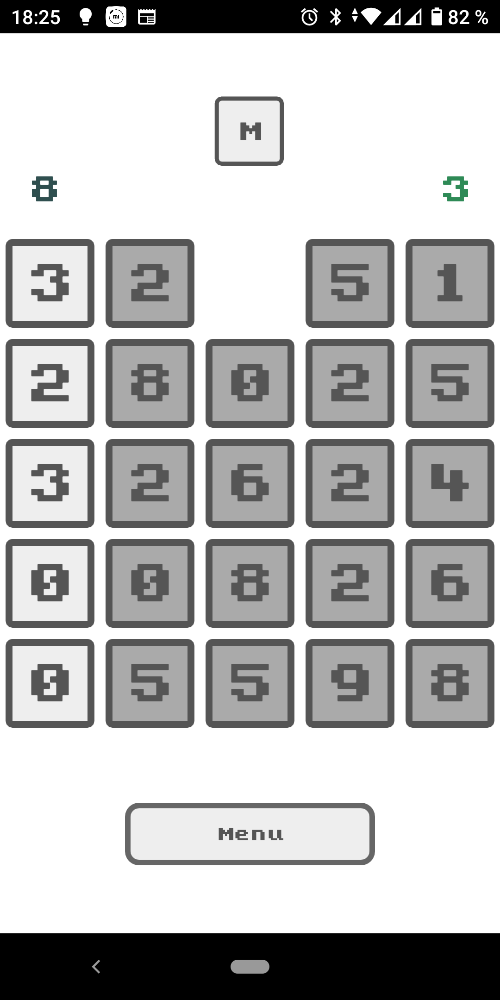

| Platform      | Build state   |
| ------------- |:-------------:|
| android-x86_64|  |
| android-x86   |  |
| android-armv7 |  |
| android-arm64-v8a|  |

# SmartTap

Простая настольная игра для двух соперников.

Игровое поле имеет форму квадрата 5x5.
Целью игры является набрать наибольшее количество очков. 

На данный момент реализовано два режима игры
* Игра против бота
* Игра двух соперников друг против друга
